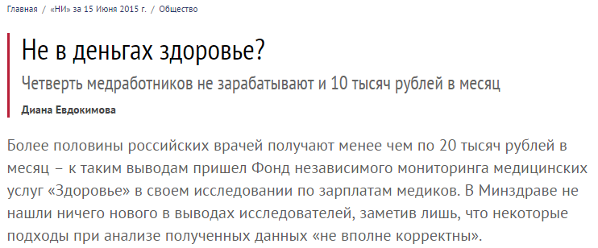
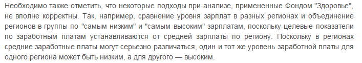
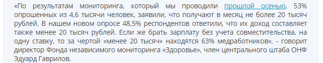
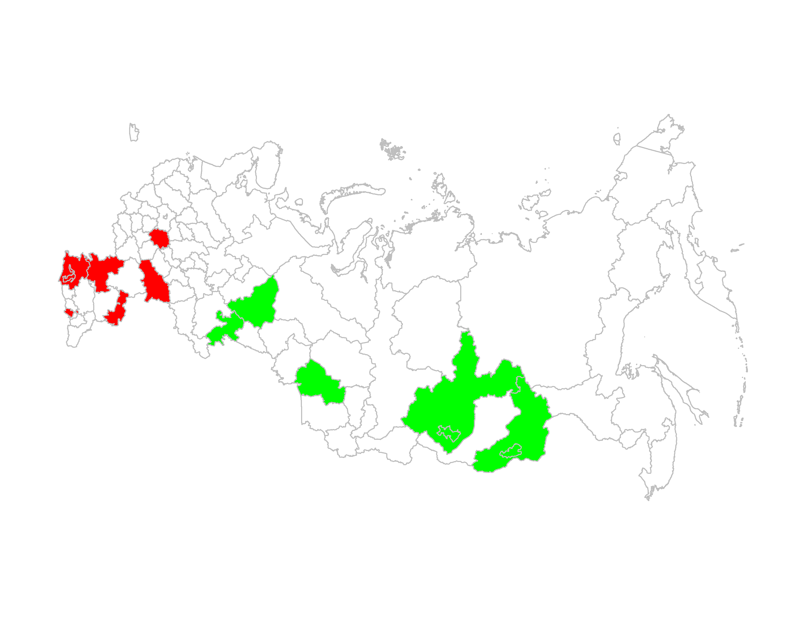

Такая история получилась после публикации результатов опроса, проведенного фондом "Здоровье".


[newizv.ru](http://www.newizv.ru/society/2015-06-15/221137-ne-v-dengah-zdorove.html)


[rosminzdrav.ru](http://www.rosminzdrav.ru/news/2015/06/13/2393-informatsiya-o-zarabotnyh-platah-meditsinskih-rabotnikov)

## Данные

Мы можем проверить результаты опроса фонда "Здоровье" и заявления Минздрава.

Данные опроса доступны здесь: [fondzdorovie.ru](http://fondzdorovie.ru/monitoring/detail_monit.php?ID=1271). Нас интересует приложение с распределениями ответов по региону. Возьмем, например, третий лист с ответами на вопрос **"Укажите уровень Вашего дохода, получаемого на должности врача  (медицинской сестры) (все ставки) в государственных медицинских организациях"**.

Также нам понадобятся данные о средних з/п по региону, попавших в опрос. Их можно взять у Росстата: [gks.ru](http://www.gks.ru/free_doc/new_site/population/trud/itog_monitor/itog-monitor1-15.html). Сдняя з/п по региону есть в каждой из этих таблиц, мы возьмем файл младшего медицинского персонала.

Все исходные данные, использованные здесь, продублированы на гитхабе: https://github.com/pased/med-income/tree/master/data/raw

Исходники всего анализа доступны здесь: https://github.com/pased/med-income/

## Анализ

Сразу же мы можем спросить: а какая средняя зарплата в этих регионах?

### Средняя зарплата в регионах и количество респондентов с з/п <10000 руб.

```{r, results='asis', warning=FALSE, message=FALSE, echo=FALSE}
library(dplyr)
load("./data/data_medinc.rda")
load("./data/med_income.rda")

library(pander)
data_medinc %>%
  filter(income == "less_10000") %>%
  select(-income) %>%
  arrange(mean_income) %>%
  pander(justif="left", round = 2,
         caption="Респонденты, выбравшие ответ <10000. Колонки: регион, количество респондентов, средняя зп в регионе, количество ответов <10000руб. Ранжирование по средней з/п.")

moscow <- data_medinc %>%
  filter(income == "less_10000") %>%
  select(-income) %>%
  filter(region == "г.Москва") %>%
  mutate(level = (freq / total_n)*100)
  
```

Первое, что бросается в глаза — очень маленькие выборки опроса: **медиана** = `r median(data_medinc$total_n)`, **SD** = `r round(sd(data_medinc$total_n), digits=2)`. Первый вывод, который можно сделать: *данные в отношении регионов не могут быть репрезентативными.* Странно, почему Минздрав начал свою критику опроса не с этого. Очевидно, что медработники с з/п <10000 руб. существуют, но сколько их в РФ мы не можем сказать.

Единственный регион с хорошей выборкой — г. Москва (n = `r moscow$total_n`). Согласно данным опроса, доля медработников, выбравших ответ "<10000 руб." в Москве составляет **`r round(moscow$level, digits=2)`%**.

### Зарплата менее 20 000 руб.


[fondzdorovie.ru](http://fondzdorovie.ru/monitoring/detail_monit.php?ID=1271)

```{r, echo=FALSE, message=FALSE, warning=FALSE, results='asis'}
data_medinc %>%
  filter(income == "less_20000") %>%
  select(-income) %>%
  arrange(mean_income) %>%
  #mutate(lvl = round((freq / total_n)*100, digits=1)) %>%
  pander(justif="left", round = 2,
         caption="Респонденты, выбравшие ответ <10000, 10000-14999, 15000-19999 и <20000. Колонки: регион, количество респондентов, средняя зп в регионе, количество ответов <20000руб. Ранжирование по средней з/п.")
```

Как доля респондентов с ответом "<20 000 руб." относиться к средней з/п в регионе?

```{r, echo=FALSE,message=FALSE,warning=FALSE}
library(ggvis)
df <- data.frame(x = 31566, y = 100)
data_medinc %>%
  filter(income == "less_20000") %>%
  select(-income) %>%
  arrange(mean_income) %>%
  mutate(lvl = round((freq / total_n)*100, digits=1),
         mean_to_mean = mean_income >= 20000) %>%
  ggvis(~mean_income, ~lvl) %>%
  layer_points(fill = ~factor(mean_to_mean), size=~freq) %>%
  layer_model_predictions(model="loess", se = TRUE) %>%
  add_legend(c("size", "fill"))

```

Синие точки - регионы, где средняя з/п не превышает 20000 руб. Размер точки — количество респондентов. Минздрав утверждает, что некорректно сравнивать и группировать регионы т.к. целевые показатели региона по зарплате устанавливаются в зависимости от средней з/п региона. Как видно, только в трех регионах средняя не превышает 20000 рублей.

```{r, echo=FALSE, warning=FALSE, message=FALSE, results='asis'}
data_medinc %>%
  filter(income == "less_20000") %>%
  select(-income) %>%
  arrange(mean_income) %>%
  mutate(lvl = round((freq / total_n)*100, digits=1),
         mean_to_mean = mean_income >= 20000) %>%
  filter(mean_to_mean == "FALSE") %>%
  select(region, mean_income, lvl) %>%
  pander(justif="left", caption = "lvl - доля респондентов, ответивших <20 000 руб.")
```

На фоне таких результатов критика Минздрава становится еще более загадочной!

## Регионы со средней з/п меньше среднероссийской (31 566 руб.)

```{r, echo=FALSE,message=FALSE,warning=FALSE}
data_medinc %>%
  filter(income == "less_20000") %>%
  select(-income) %>%
  arrange(mean_income) %>%
  mutate(lvl = round((freq / total_n)*100, digits=1),
         mean_to_mean = mean_income > 31566) %>%
  filter(mean_to_mean == "FALSE") %>%
  mutate(weird = (lvl > 75 & mean_income > 20000) | (lvl < 50 & mean_income > 20000)) %>%
  ggvis(~mean_income, ~lvl) %>%
  layer_points(fill=~factor(weird), size=~freq) %>%
  layer_model_predictions(model="loess", se = TRUE) %>%
  add_legend(c("size", "fill"))

```

```{r,echo=FALSE,warning=FALSE,message=FALSE,results='asis'}
data_medinc %>%
  filter(income == "less_20000") %>%
  select(-income) %>%
  arrange(mean_income) %>%
  mutate(lvl = round((freq / total_n)*100, digits=1),
         mean_to_mean = mean_income > 31566) %>%
  filter(mean_to_mean == "FALSE") %>%
  mutate(weird = lvl > 75 & mean_income > 20000) %>%
  filter(weird == "TRUE") %>%
  select(region, mean_income, lvl) %>%
  arrange(lvl) %>%
  pander(justif="left", caption = "Регионы со средней з/п >20 000 руб. и долей респондентов с з/п <20 000 руб., превышающей 75%. lvl - доля респондентов, ответивших <20 000 руб. Ранжирование по доле респондентов.")
```

```{r,echo=FALSE,warning=FALSE,message=FALSE,results='asis'}
data_medinc %>%
  filter(income == "less_20000") %>%
  select(-income) %>%
  arrange(mean_income) %>%
  mutate(lvl = round((freq / total_n)*100, digits=1),
         mean_to_mean = mean_income > 31566) %>%
  filter(mean_to_mean == "FALSE") %>%
  mutate(weird = lvl < 50 & mean_income > 20000) %>%
  filter(weird == "TRUE") %>%
  select(region, mean_income, lvl) %>%
  arrange(lvl) %>%
  pander(justif="left", caption = "Регионы со средней з/п >20 000 руб. и долей респондентов с з/п <20 000 руб., <50%. lvl - доля респондентов, ответивших <20 000 руб. Ранжирование по доле респондентов.")
```



